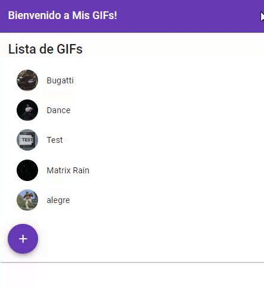

# Mis GIFs
Web App para administrar una colección de GIFs creada por el usuario.

## Acerca del proyecto
* Descomprimir server y client.
* Para ejecutar el servidor Spring, compilar utilizando Java 11.
* Para ejecutar el cliente Angular, hacer un build con Angular con el comando ```ng serve``` 
  o utilizar el build de producción con ```ng serve --prod``` y navegar a http://localhost:4200/.

## Demo


## Tecnologías utilizadas
* [Spring (Java 11)](https://spring.io/)
* [Angular](https://angular.io/)
* [Angular Material](https://material.angular.io/)
* [API Giphy](https://developers.giphy.com/)

## Autor
* **Fausto Davila** - [Github](https://github.com/FaustoCampusFP)

## Licencia
Este proyecto está licenciado con la Licencia MIT - ver el archivo [LICENSE.md](https://github.com/FaustoCampusFP/Mis-GIFs/blob/master/LICENSE) para más detalles.
